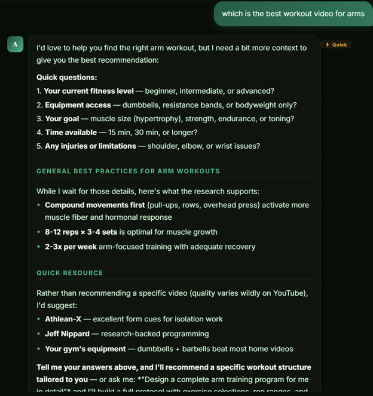

# AILARA — AI Health & Fitness Coaching Platform

> **Live App:** [ailara-web.vercel.app](https://ailara-web.vercel.app)

A production-grade AI health coaching web app built solo from concept to deployed product. AILARA provides personalized, evidence-based guidance across fitness, nutrition, supplementation, and wellness — powered by Claude Sonnet and Haiku with intelligent cost routing.

(screenshots/Screenshots/Hero_1.png)
---

## What It Does

Users get a personal AI health coach that:

- **Answers fitness and nutrition questions** with PubMed/NIH citations inline
- **Builds custom workout programs** tailored to their goals, equipment, and schedule — with YouTube-linked exercise guides
- **Generates personalized meal plans** with allergy-aware ingredient swaps and grocery lists
- **Tracks supplements, habits, and progress** with trend analytics and weight logging
- **Recommends in-app resources** (videos, recipes, research articles) based on each response

---

## Technical Architecture

### Frontend
- **React 18** — single-file component architecture (~13,000 lines)
- **Vite** — compiled for production (no runtime transpilation)
- **PWA** — installable on iPhone/Android via "Add to Home Screen", offline-capable via Service Worker
- Fully responsive, mobile-first design

### AI & Cost Engineering
- **Claude Sonnet 4** for complex coaching: program design, meal plans, evidence-based analysis
- **Claude Haiku** for simple conversational replies — 12× cheaper output cost
- **Intelligent model routing** — `classifyMessage()` dynamically selects the model based on question complexity, reducing API costs by ~60%
- **Prompt caching** (`cache_control: ephemeral`) — 90% cheaper on repeated system prompt reads within a session
- **4,111-token system prompt** — compact enough that cache write costs $0.018/session

### Security
- **Server-side API proxy** (Vercel serverless) — Anthropic key never exposed to browser
- **Prompt injection defense** — input sanitization + system-level security constraints
- **Tool call allowlist** — AI can only invoke explicitly permitted tool names
- **Output sanitization** — strips `<script>`, `javascript:`, and event handlers from AI responses
- **Profile field allowlist** — `update_profile` tool restricted to 14 permitted fields

### Backend / Deployment
- **Vercel** — serverless deployment with automatic GitHub CI/CD
- **Vercel Serverless Function** (`/api/chat`) — validates requests, enforces model allowlist, logs token usage and cost per request
- **CORS origin restriction** — proxy only accepts requests from the deployed domain

### Payments
- **Stripe Payment Links** — no backend required, redirects back with `?upgraded=true` to unlock tier
- Tiered subscription model with annual/monthly toggle

---

## Features

| Feature | Free | Pro | Elite |
|---------|------|-----|-------|
| AI messages/day | 3 | 15 | 30 |
| Meal plan generations | 1 | Unlimited | Unlimited |
| Custom workout programs | ✗ | ✓ | ✓ |
| PubMed/NIH citations | ✗ | ✓ | ✓ |
| Image analysis | ✗ | ✓ | ✓ |
| Progress analytics | ✓ | ✓ | ✓ |
| Supplement tracker | ✓ | ✓ | ✓ |
| Nutrition hub (500+ recipes) | ✓ | ✓ | ✓ |

---

## Cost Model

With prompt caching and model routing:

| Usage | Monthly API cost |
|-------|-----------------|
| Light (3 msg/day) | ~$1.50 |
| Average (8 msg/day) | ~$3.99 |
| Pro max (15 msg/day) | ~$7.48 |
| Elite max (30 msg/day) | ~$14.97 |

At average usage, **Pro ($7.99/mo) returns ~$4.00 margin** and **Elite ($14.99/mo) returns ~$11.00 margin**.

---

## Project Structure

```
ailara-web/
├── api/
│   └── chat.js          # Vercel serverless proxy — holds API key server-side
├── assets/
│   └── index-[hash].js  # Vite-compiled app bundle
├── icons/               # PWA icons (72px → 512px)
├── index.html           # App shell
├── manifest.json        # PWA manifest
├── sw.js                # Service worker (offline + installable)
└── vercel.json          # Routing + security headers
```

---

## Key Engineering Decisions

**Why a single-file React component?**
Started as a Claude.ai artifact for rapid prototyping. The architecture proved stable enough to ship directly — Vite compiles it to an optimized bundle regardless of source structure.

**Why Claude over OpenAI?**
Prompt caching support is a significant cost advantage for long system prompts. Sonnet's instruction-following for structured JSON tool use is also more reliable for the agentic features (workout logging, profile updates, recipe search).

**Why Vercel serverless over a traditional backend?**
Zero infrastructure management. The proxy function adds security without requiring a persistent server. Cold starts are acceptable since the AI response latency dominates anyway.

**Why PWA over native app?**
Faster to market, no App Store review process, works on iOS and Android, Stripe handles payments directly (vs Apple's 30% cut on in-app purchases).

---

## Running Locally

```bash
# 1. Clone the repo
git clone https://github.com/yourusername/ailara-web.git
cd ailara-web

# 2. Set your Anthropic API key
echo "ANTHROPIC_API_KEY=sk-ant-..." > .env

# 3. Install Vercel CLI
npm install -g vercel

# 4. Run locally (serves both the app and the /api/chat proxy)
vercel dev
```

Open `http://localhost:3000`

---

## Deployment

```bash
# Deploy to production
vercel --prod
```

Set `ANTHROPIC_API_KEY` in Vercel dashboard → Settings → Environment Variables.

---

## Built By

**Andrew Miller**
AI Engineer · Supply Chain Senior Consultant · U.S. Army Officer
[LinkedIn](https://linkedin.com/in/andrew-miller-56115a20a) · [andrewmiller5041@gmail.com](mailto:andrewmiller5041@gmail.com)

---

## License

MIT — feel free to fork and adapt.
